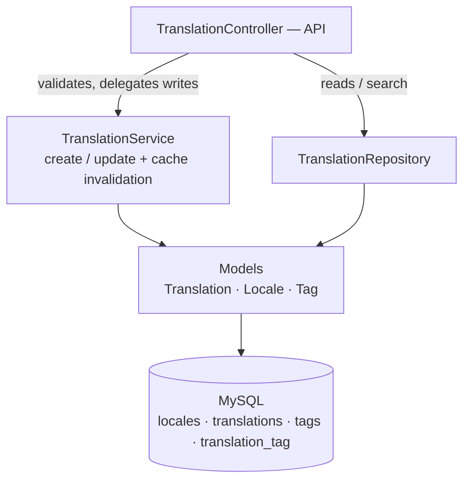

# Translation Service — i18n Microservice

> **Laravel 12 REST API microservice** for managing application translations across multiple locales. Supports tag-based categorization, full-text search, cached locale exports, and a clean Service + Repository architecture. Ships with an OpenAPI spec and Docker Compose setup.


---

## Tech Stack

| Package | Version | Purpose |
|---|---|---|
| `laravel/framework` | ^12 | Core framework |
| `laravel/sanctum` | ^4.2 | API token authentication |
| PHPUnit | ^11 | Testing |
| Laravel Pail | — | Log tailing |
| Laravel Pint | — | Code style |

---

## Architecture



**Pattern:** Controller validates → Service handles business logic + cache invalidation → Repository handles reads/search.

---

## Database Schema

| Table | Key Columns |
|---|---|
| `locales` | id, code (`en`, `fr`, `ar`, ...), name |
| `translations` | id, locale_id FK, key (string), content (text) |
| `tags` | id, name |
| `translation_tag` | translation_id, tag_id (many-to-many pivot) |
| `personal_access_tokens` | Sanctum tokens |

---

## API Endpoints

All Sanctum-protected (`auth:sanctum` middleware):

| Method | Endpoint | Description |
|---|---|---|
| `POST` | `/api/translations` | Create translation + sync tags |
| `PUT` | `/api/translations/{id}` | Update translation + sync tags |
| `GET` | `/api/translations/{id}` | Get single translation (with locale + tags eager-loaded) |
| `GET` | `/api/translations/search` | Search via `TranslationRepository` |
| `GET` | `/api/translations/export/{locale}` | Export full key→content map for a locale |

---

## Key Features

### Cached Locale Export
`GET /api/translations/export/{locale}` returns a flat `{ key: content }` map for all translations in a locale.

```php
// Result is cached for 60 minutes
cache()->remember("translations:{$locale_code}", 3600, fn() =>
    Translation::where('locale_id', $locale->id)->pluck('content', 'key')
)
```

Cache is invalidated on every `create` or `update` via `TranslationService`:
```php
cache()->forget("translations:{$locale_code}");
```

This makes the export endpoint suitable for app-bootstrap consumption or CDN caching — fast reads, instant invalidation on update.

### Tag Taxonomy
Translations can be tagged for categorization. `TranslationService` syncs tags on create/update via `$translation->tags()->sync($tagIds)`.

### Search
`TranslationRepository::search()` handles search queries across translation keys and content.

### One-Command Setup
```bash
composer setup
# Runs: composer install, cp .env.example .env, php artisan key:generate,
#        php artisan migrate, npm install, npm run build
```

---

## Getting Started

```bash
composer install
cp .env.example .env
php artisan key:generate
php artisan migrate
php artisan serve

# Or with Docker:
docker-compose up
```

**API documentation:** See `openapi.yaml` in the repo root for the full OpenAPI 3.0 specification.
